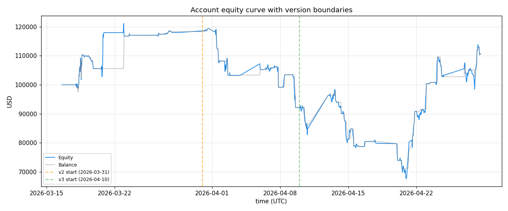
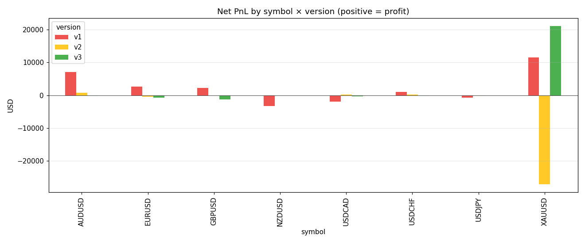
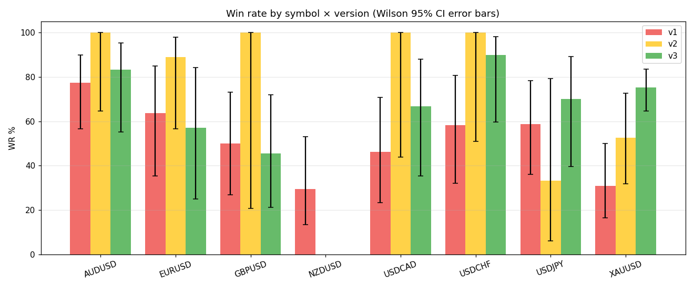
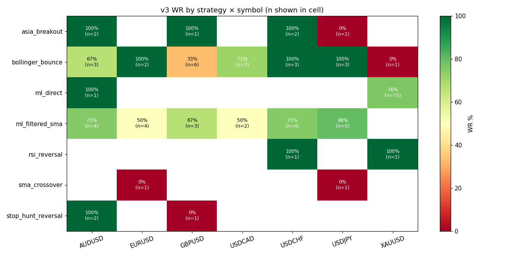
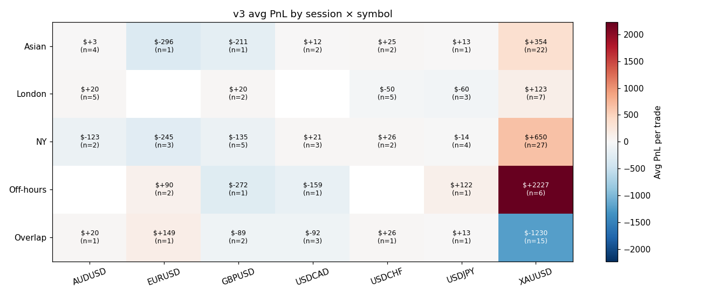
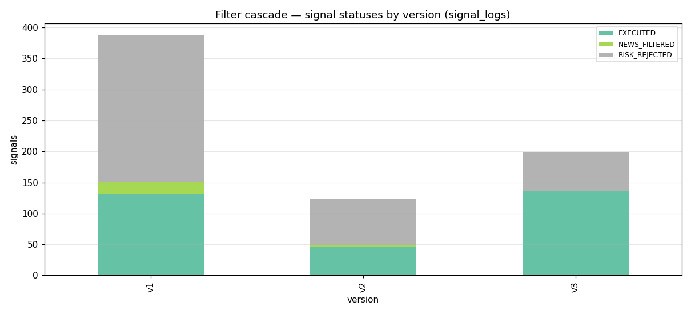
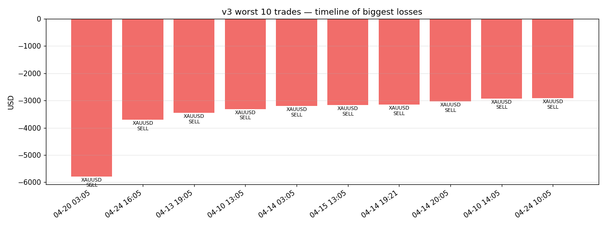

# ForexAI — Full Trade Evolution Report

*Generated: 2026-04-28 (auto-produced by `scripts/analyze_all_trades.py`)*
*Scope: all closed trades across v1 (OLD), v2 (TRANSITION), v3 (STABLE) — total **315** trades, **314** closed*
*Authority level: **authoritative for v3; context-only for v1/v2***
*Source: live `data/trading.db` for v3; `data/ml_training/*.csv` for v1/v2*

---

## 1. Executive Summary

After **37+ days** of paper trading across three engine versions, the account stands at **$110,606.79** (equity **$110,629.59**) — cumulative net change **$+10,606.79** (+10.61%) from the **$100,000** starting balance.

v3 is the only authoritative window for evaluation: **137 trades, +$18,441.21**. v1 (+$18,637.62) is context-only (oversized lots, no risk controls). v2 ($-26,472.04) is invalid (construction zone, 13 config changes in 10 days).

**Three most important findings:**

1. **v3 is a single-symbol system.** 77 of 136 v3 trades (57%) are XAUUSD. Without XAUUSD, v3 PnL is **$-2,668.59**. With it, **+$18,441.21**.
2. **OVERLAP session (13:00-17:00 UTC) is the loss concentration on XAUUSD:** 15 trades, **$-18,455.00**. Every other session on XAUUSD is profitable (non-overlap PnL **$+39,564.80**).
3. **Strategy pathology — `bollinger_bounce`: 68.0% WR but $-3,005.56** over 25 trades. Profit factor 0.257, R:R 0.121 — the classic small-wins, big-losses trap.

## 2. Project-wide Aggregates

### 2.1 Trade count by version × symbol

| symbol | v1 | v2 | v3 | total |
|---|---:|---:|---:|---:|
| XAUUSD | 26 | 19 | 77 | 122 |
| AUDUSD | 22 | 7 | 12 | 41 |
| USDJPY | 17 | 3 | 10 | 30 |
| EURUSD | 11 | 9 | 7 | 27 |
| USDCHF | 12 | 4 | 10 | 26 |
| GBPUSD | 14 | 1 | 11 | 26 |
| USDCAD | 13 | 3 | 9 | 25 |
| NZDUSD | 17 | 0 | 0 | 17 |

### 2.2 Net PnL by version

| version | trades | closed | net PnL | notes |
|---|---:|---:|---:|---|
| v1 (OLD)        | 132 | 132 | **$+18,637.62** | Context-only — oversized lots, no risk controls |
| v2 (TRANSITION) | 46 | 46 | **$-26,472.04** | Invalid — construction zone, segmentation_log marks not-for-eval |
| v3 (STABLE)     | 137 | 136 | **$+18,441.21** | Authoritative for evaluation |
| **cumulative**  | **315** | **314** | **$+10,606.79** | from $100,000 start |

## 3. Per-Symbol Summary (v3)

| symbol | trades | wins | losses | WR % | WR 95% CI | total PnL | avg PnL | R:R | PF | underpowered |
|---|---:|---:|---:|---:|---|---:|---:|---:|---:|:---:|
| XAUUSD | 77 | 58 | 19 | 75.3 | [64.7, 83.6] | $+21,109.80 | $+274.15 | 0.465 | 1.420 | no |
| USDJPY | 10 | 7 | 3 | 70.0 | [39.7, 89.2] | $-87.95 | $-8.80 | 0.352 | 0.821 | no |
| AUDUSD | 12 | 10 | 2 | 83.3 | [55.2, 95.3] | $-111.40 | $-9.28 | 0.153 | 0.765 | no |
| USDCHF | 10 | 9 | 1 | 90.0 | [59.6, 98.2] | $-124.33 | $-12.43 | 0.072 | 0.648 | no |
| USDCAD | 9 | 6 | 3 | 66.7 | [35.4, 87.9] | $-346.91 | $-38.55 | 0.114 | 0.227 | ⚠ YES |
| EURUSD | 7 | 4 | 3 | 57.1 | [25.1, 84.2] | $-703.40 | $-100.49 | 0.269 | 0.358 | ⚠ YES |
| GBPUSD | 11 | 5 | 6 | 45.5 | [21.3, 72.0] | $-1,294.60 | $-117.69 | 0.117 | 0.097 | no |

### 3.1 XAUUSD spotlight

Across all 3 versions, XAUUSD has **16 BUY trades and 106 SELL trades**. Zero BUYs in any version. 
This is a **persistent system characteristic**, not a recent drift. Detailed investigation: `docs/research/xauusd_sell_analysis.md`.

**OVERLAP session loss concentration (v3):** 15 trades, **$-18,455.00**.
**Non-OVERLAP XAUUSD (v3):** 62 trades, **$+39,564.80**.

**The OVERLAP-session filter is the highest-leverage single change available.**

## 4. Per-Strategy Summary (v3)

| strategy | trades | WR % | WR 95% CI | total PnL | avg PnL | R:R | PF | underpowered |
|---|---:|---:|---|---:|---:|---:|---:|:---:|
| `bollinger_bounce` | 25 | 68.0 | [48.4, 82.8] | $-3,005.56 | $-120.22 | 0.121 | 0.257 | no |
| `ml_filtered_sma` | 22 | 68.2 | [47.3, 83.6] | $-1,338.11 | $-60.82 | 0.106 | 0.228 | no |
| `sma_crossover` | 2 | 0.0 | [0.0, 65.8] | $-627.23 | $-313.62 | — | — | ⚠ YES |
| `stop_hunt_reversal` | 3 | 66.7 | [20.8, 93.8] | $-158.00 | $-52.67 | 0.101 | 0.202 | ⚠ YES |
| `asia_breakout` | 6 | 83.3 | [43.6, 97.0] | $-24.33 | $-4.06 | 0.164 | 0.820 | ⚠ YES |
| `rsi_reversal` | 2 | 100.0 | [34.2, 100.0] | $+205.64 | $+102.82 | — | — | ⚠ YES |
| `ml_direct` | 76 | 76.3 | [65.6, 84.5] | $+23,388.80 | $+307.75 | 0.462 | 1.489 | no |

### Strategy pathologies (high WR + losing money)

- **`bollinger_bounce`** — 25 trades, **68% WR**, **$-3,005.56** net. PF 0.257, R:R 0.121. Avg loss is far larger than avg win — the small-wins, big-losses trap.
- **`ml_filtered_sma`** — 22 trades, **68% WR**, **$-1,338.11** net. PF 0.228, R:R 0.106. Avg loss is far larger than avg win — the small-wins, big-losses trap.

## 5. Session Analysis (v3)

Session × symbol PnL (USD):

| session | AUDUSD | EURUSD | GBPUSD | USDCAD | USDCHF | USDJPY | XAUUSD | row total |
|---|---:|---:|---:|---:|---:|---:|---:|---:|
| Asian | $+13 | $-296 | $-211 | $+23 | $+51 | $+13 | $+7,786 | **$+7,379** |
| London | $+101 | 0 | $+40 | 0 | $-252 | $-179 | $+862 | $+572 |
| NY | $-245 | $-735 | $-673 | $+64 | $+51 | $-56 | $+17,554 | **$+15,960** |
| Off-hours | 0 | $+179 | $-272 | $-159 | 0 | $+122 | $+13,363 | **$+13,232** |
| Overlap | $+20 | $+149 | $-178 | $-275 | $+26 | $+13 | $-18,455 | **$-18,701** |

## 6. Filter Effectiveness

Signal status counts per version (from `signal_logs`):

| status | v1 | v2 | v3 |
|---|---:|---:|---:|
| EXECUTED | 132 | 46 | 137 |
| NEWS_FILTERED | 19 | 3 | 0 |
| RISK_REJECTED | 236 | 74 | 62 |

## 7. Worst 10 v3 Trades

| ticket | open (UTC) | symbol | dir | strategy | session | conf % | net PnL | exit |
|---|---|---|---|---|---|---:|---:|---|
| 56297066579 | 2026-04-20 03:05 | XAUUSD | SELL | `ml_direct` | Asian | 55.1 | $-5,787.00 | SL_HIT |
| 56387752068 | 2026-04-24 16:05 | XAUUSD | SELL | `ml_direct` | Overlap | 56.8 | $-3,702.00 | SL_HIT |
| 56215216555 | 2026-04-13 19:05 | XAUUSD | SELL | `ml_direct` | NY | 57.7 | $-3,453.00 | SL_HIT |
| 56185954180 | 2026-04-10 13:05 | XAUUSD | SELL | `ml_direct` | Overlap | 58.0 | $-3,314.00 | SL_HIT |
| 56220507686 | 2026-04-14 03:05 | XAUUSD | SELL | `ml_direct` | Asian | 61.2 | $-3,200.00 | SL_HIT |
| 56247698914 | 2026-04-15 13:05 | XAUUSD | SELL | `ml_direct` | Overlap | 56.5 | $-3,169.00 | SL_HIT |
| 56236276608 | 2026-04-14 19:21 | XAUUSD | SELL | `ml_direct` | NY | 57.2 | $-3,152.60 | SL_HIT |
| 56236987831 | 2026-04-14 20:05 | XAUUSD | SELL | `ml_direct` | NY | 59.7 | $-3,029.00 | SL_HIT |
| 56186807238 | 2026-04-10 14:05 | XAUUSD | SELL | `ml_direct` | Overlap | 55.3 | $-2,922.00 | SL_HIT |
| 56382122993 | 2026-04-24 10:05 | XAUUSD | SELL | `ml_direct` | London | 55.0 | $-2,912.00 | SL_HIT |

## 8. Best 10 v3 Trades

| ticket | open (UTC) | symbol | dir | strategy | session | conf % | net PnL | exit |
|---|---|---|---|---|---|---:|---:|---|
| 56337077412 | 2026-04-21 22:05 | XAUUSD | SELL | `ml_direct` | Off-hours | 55.8 | $+3,861.00 | TP_HIT |
| 56193408926 | 2026-04-10 19:06 | XAUUSD | SELL | `ml_direct` | NY | 60.2 | $+3,665.40 | TP_HIT |
| 56333314623 | 2026-04-21 19:05 | XAUUSD | SELL | `ml_direct` | NY | 64.6 | $+3,611.00 | TP_HIT |
| 56378908567 | 2026-04-24 05:05 | XAUUSD | SELL | `ml_direct` | Asian | 64.4 | $+3,525.00 | TP_HIT |
| 56378377350 | 2026-04-24 04:05 | XAUUSD | SELL | `ml_direct` | Asian | 63.8 | $+3,513.00 | TP_HIT |
| 56315435636 | 2026-04-20 21:05 | XAUUSD | SELL | `ml_direct` | NY | 57.7 | $+3,466.40 | TP_HIT |
| 56241698595 | 2026-04-15 05:05 | XAUUSD | SELL | `ml_direct` | Asian | 56.0 | $+3,419.00 | TP_HIT |
| 56195273438 | 2026-04-10 21:05 | XAUUSD | SELL | `ml_direct` | NY | 63.2 | $+3,344.40 | TP_HIT |
| 56196075356 | 2026-04-10 22:05 | XAUUSD | SELL | `ml_direct` | Off-hours | 60.5 | $+3,320.40 | TP_HIT |
| 56393838928 | 2026-04-24 22:05 | XAUUSD | SELL | `ml_direct` | Off-hours | 59.0 | $+3,146.40 | TP_HIT |

## 9. Recommendations (auto-derived)

Each recommendation requires ≥10 v3 trades or ≥5 v3 trades with consistent v1/v2 pattern.

**R1 — Block XAUUSD SELL during OVERLAP session (13:00-17:00 UTC).** 
Evidence: 15 v3 trades, total **$-18,455.00**. Non-OVERLAP XAUUSD: $+39,564.80. Highest single-change PnL recovery available.

**R2 — Retire or restructure `bollinger_bounce`.** 
Evidence: 25 v3 trades, 68% WR but $-3,005.56 net. R:R 0.12, PF 0.26. Structural P&L asymmetry.

**R3 — Retire or restructure `ml_filtered_sma`.** 
Evidence: 22 v3 trades, 68% WR but $-1,338.11 net. R:R 0.11, PF 0.23. Structural P&L asymmetry.

**R4 — Defer per-symbol decisions for non-XAUUSD pairs.** 
Evidence: 12 of 14 per-symbol-per-direction cells in v3 are UNDERPOWERED (n<10). No statistical basis for symbol-level retirement outside XAUUSD until Phase 8 collects more data.

## 10. Methodology & Caveats

- **Source priority:** v3 from live `data/trading.db` (fresh data); v1/v2 from `data/ml_training/*.csv` (frozen historical). All other tables (signal_logs, market_contexts, indicator_snapshots, shadow_signals) joined live.
- **Joins:** trade_results joined on `ticket` (exact). signal_logs / market_contexts / indicator_snapshots / shadow_signals joined via `pd.merge_asof` with `by=symbol` and ±5 min tolerance.
- **Statistical tests:** Wilson-score 95% CI on every WR. Underpowered cells (n<10) flagged explicitly and excluded from recommendations.
- **Known data quality issues:** `trade_results.h1_trend / h4_trend / volatility_regime` are NULL in the live DB (engine schema-drift). Sourced from `market_contexts` instead via asof-join.
- **Shadow gap:** 6-day shadow-signals outage 2026-04-16 → 2026-04-22 limits filter-effectiveness counterfactual analysis on v3.

**This analysis cannot answer:**
- Will v3 be profitable over the next 30 days? (Phase 8 paper trading is the answer-generator.)
- Is XAUUSD's edge durable? (37 days of data in one regime cannot establish portability.)
- The system's true Sharpe? (Sample too small for a meaningful estimate.)

## 11. Reference Files

- `artifacts/all_trades_enriched.csv` — master per-trade dataset
- `artifacts/data_completeness_report.csv` — per-field availability
- `artifacts/summary_by_*.csv` — 7 pivoted summaries
- `docs/research/charts/*.png` — 10 charts
- `scripts/analyze_all_trades.py` — re-runnable; this report regenerates on every run
- `docs/research/xauusd_sell_analysis.md` — XAUUSD detailed investigation
- `docs/research/decision_log.md` — running decision history

*End of report. Auto-generated 2026-04-28.*