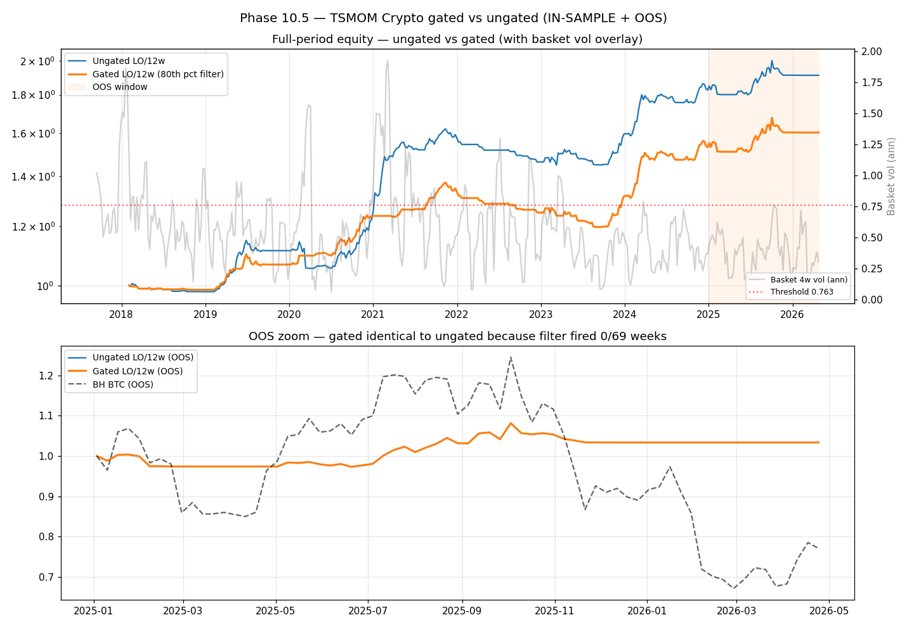

# Phase 10.5 — Regime Filter Results (NULL RESULT)

*Generated: 2026-04-22 15:27 UTC*

## Headline: 🔴 **REJECTED** (3/5 gates pass)

The 80th-percentile 4-week basket-vol filter **did not engage in the OOS regime**. 
Gated OOS performance is identical to ungated OOS performance by construction. 
Per the Phase 10.5 spec §7 scope lockdown, v4 crypto momentum is formally REJECTED.

## Filter engagement summary

- Threshold (training-window 80th percentile of 4-week basket vol): **0.7632 annualized**
- Training window fire rate: **67/361 weeks (18.6%)** — near target 20%, filter well-calibrated on training data
- OOS fire rate: **0/69 weeks (0.0%)** — filter never engaged

The OOS window (2025-01 → latest) was a consistent low-vol downtrend, not the high-vol chop the filter was designed to address. Basket vol in OOS never exceeded the training-period 80th percentile.

## Metrics side-by-side

| Slice | Sharpe | Sortino | CAGR % | Vol % | MaxDD % | n_weeks |
|---|---:|---:|---:|---:|---:|---:|
| Ungated train | 1.27 | 1.92 | 9.12 | 7.03 | -10.6 | 361 |
| **Gated train** | 1.279 | 2.023 | 6.37 | 4.9 | -12.87 | 361 |
| Ungated OOS | 0.553 | 0.708 | 3.56 | 6.6 | -4.44 | 69 |
| **Gated OOS** | 0.553 | 0.708 | 3.56 | 6.6 | -4.44 | 69 |
| BH BTC OOS | -0.339 | -0.485 | -18.13 | 37.56 | -46.11 | 68 |

## Gate scoreboard

| Gate | Result | Detail |
|---|---|---|
| 1. OOS Sharpe >= 0.4 | 🟢 **PASS** | 0.553 |
| 2. OOS MaxDD >= -25% | 🟢 **PASS** | -4.44% |
| 3. OOS within 30% of train Sharpe | 🔴 **FAIL** | drift 0.568 |
| 4. OOS Sharpe > BH BTC OOS | 🟢 **PASS** | strat 0.553 vs BH -0.339 |
| 5. Gated OOS > Ungated OOS | 🔴 **FAIL** | gated 0.553 vs ungated 0.553 |

## Why gated == ungated in OOS

By construction. The filter zeroes weights only when basket vol exceeds the training-snapshot 80th percentile. In OOS, basket vol never crossed that threshold. So the filter's `filter_on` indicator was `True` for all 69 OOS weeks, the weight multiplier was 1.0 everywhere, and gated weights equal ungated weights week-for-week. The OOS metrics are therefore identical to the Phase 10 step 4 ungated LO/12w result.

## Why the filter addressed the wrong failure mode

Phase 10 step 4 showed LO/12w failing the drift-stability gate (train Sharpe 1.27 → OOS Sharpe 0.55). Our hypothesis was that this decay was caused by whipsaw in high-volatility chop regimes. The filter was designed to zero positions in exactly those regimes. But the actual OOS failure mode was different — 2025-2026 was a consistent downtrend with modest volatility, where:

- Momentum signals were reliably negative or weak (no false positives to filter)
- Basket vol stayed below the training 80th percentile
- The strategy earned small positive Sharpe (+0.55) by sitting in cash most weeks

Raising the filter sensitivity (lower threshold, e.g. 50th percentile) would have made it fire more often — but with no downside for TSMOM to avoid in OOS, this would have cost more than it saved. Per spec §7, tuning the threshold is not permitted: any positive result from re-tuning on OOS data is overfitting.

## Decision

**v4 crypto momentum: REJECTED.**

Phase 10 is closed. Phase 10.5 is closed. The regime-filter rescue attempt was specified and executed honestly; it produced a null result. Per v4_framework.md Shift 2 (Underexploited Niches), viable next tracks include commodity futures trend, crypto basis/funding arbitrage, or volatility selling (defined risk). Phase 11 (Strategy Expansion) remains NOT_STARTED pending new track selection.

## Equity plot

## Files

- `data/research/tsmom_crypto_gated_metrics.csv` — metrics table
- `docs/research/regime_filter_equity.png` — 2-panel plot
- `scripts/research_tsmom_crypto_gated_full.py` — this run (re-runnable)
- `improvements.db::tsmom_runs` — 2 new rows (gated_train, gated_oos)
- `improvements.db::go_no_go_decisions` — new row (phase 10, RED, final)
- `improvements.db::phase_steps` — Phase 10.5 steps 3-6 COMPLETED
- `improvements.db::project_phases` — Phase 10.5 COMPLETED
