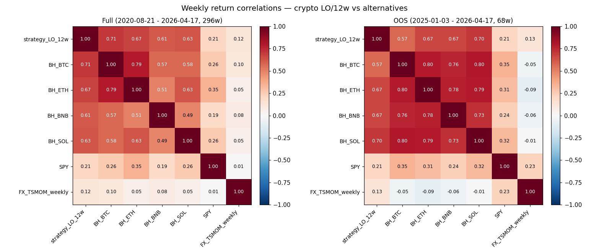

# TSMOM Crypto — Correlation & Diversification (Phase 10 step 5)

*Generated: 2026-04-21 18:33 UTC*

## Purpose

Determine whether **crypto LO/12w** (the only step-4 variant that cleared the absolute OOS Sharpe gate of 0.4) adds real diversification to an existing book. Binary decision driver for the Phase-10 go/no-go between Option 1 (reject) and Option 4 (rescue with regime filter).

## Setup

| Item | Value |
|---|---|
| Strategy    | Crypto LO/12w/10bps (from Phase 10 step 3) |
| Frequency   | Weekly returns (W-FRI close) |
| Full window | Intersection of all series — starts when all have data |
| OOS window  | 2025-01-01 onwards (same as step 4) |
| SPY source  | yfinance, auto-adjusted, resampled W-FRI |
| FX TSMOM    | Rebuilt at weekly LO/12w/24w/10%/10bps (matches crypto methodology) — **NOT** the published monthly LS baseline (Sharpe 0.126). See caveats. |

## Correlation — full window

Window: 2020-08-21 to 2026-04-17 (296 weeks)

| | `strategy_LO_12w` | `BH_BTC` | `BH_ETH` | `BH_BNB` | `BH_SOL` | `SPY` | `FX_TSMOM_weekly` |
|---|---:|---:|---:|---:|---:|---:|---:|
| `strategy_LO_12w` | +1.000 | +0.710 | +0.672 | +0.613 | +0.630 | +0.211 | +0.122 |
| `BH_BTC` | +0.710 | +1.000 | +0.795 | +0.575 | +0.576 | +0.265 | +0.102 |
| `BH_ETH` | +0.672 | +0.795 | +1.000 | +0.505 | +0.626 | +0.348 | +0.054 |
| `BH_BNB` | +0.613 | +0.575 | +0.505 | +1.000 | +0.491 | +0.189 | +0.082 |
| `BH_SOL` | +0.630 | +0.576 | +0.626 | +0.491 | +1.000 | +0.261 | +0.047 |
| `SPY` | +0.211 | +0.265 | +0.348 | +0.189 | +0.261 | +1.000 | +0.007 |
| `FX_TSMOM_weekly` | +0.122 | +0.102 | +0.054 | +0.082 | +0.047 | +0.007 | +1.000 |

## Correlation — OOS window

Window: 2025-01-03 to 2026-04-17 (68 weeks)

| | `strategy_LO_12w` | `BH_BTC` | `BH_ETH` | `BH_BNB` | `BH_SOL` | `SPY` | `FX_TSMOM_weekly` |
|---|---:|---:|---:|---:|---:|---:|---:|
| `strategy_LO_12w` | +1.000 | +0.573 | +0.667 | +0.671 | +0.703 | +0.206 | +0.127 |
| `BH_BTC` | +0.573 | +1.000 | +0.797 | +0.763 | +0.801 | +0.348 | -0.045 |
| `BH_ETH` | +0.667 | +0.797 | +1.000 | +0.777 | +0.793 | +0.308 | -0.086 |
| `BH_BNB` | +0.671 | +0.763 | +0.777 | +1.000 | +0.730 | +0.241 | -0.060 |
| `BH_SOL` | +0.703 | +0.801 | +0.793 | +0.730 | +1.000 | +0.321 | -0.008 |
| `SPY` | +0.206 | +0.348 | +0.308 | +0.241 | +0.321 | +1.000 | +0.225 |
| `FX_TSMOM_weekly` | +0.127 | -0.045 | -0.086 | -0.060 | -0.008 | +0.225 | +1.000 |

## Headline — crypto strategy row only

| Counterparty | Full-window ρ | OOS ρ | Verdict (low=diversifying, high=proxy) |
|---|---:|---:|---|
| `BH_BTC` | +0.710 | +0.573 | moderate |
| `BH_ETH` | +0.672 | +0.667 | **high** — correlated |
| `BH_BNB` | +0.613 | +0.671 | **high** — correlated |
| `BH_SOL` | +0.630 | +0.703 | **high** — correlated |
| `SPY` | +0.211 | +0.206 | low — mild diversification |
| `FX_TSMOM_weekly` | +0.122 | +0.127 | **near-zero** — diversifying |

## Diversification ratio

DR = (time-averaged weighted avg of individual asset vols) / (portfolio vol). Higher = more diversification benefit realized.

| Window | Portfolio vol (ann) | Weighted asset vol | DR | Mean gross exposure |
|---|---:|---:|---:|---:|
| Full | 0.0697 | 0.0652 | **0.936** | 0.077 |
| OOS  | 0.066 | 0.047 | **0.712** | 0.093 |

## Decision grid (from your Phase-10 rules)

| Condition | Implication | Status (OOS) |
|---|---|---|
| ρ(FX) < 0.3 AND ρ(SPY) < 0.3 | → Option 4 (rescue with regime filter) | MET  (FX=+0.13, SPY=+0.21) |
| ρ(BTC) > 0.7 | → Option 1 (reject, pivot) | NOT MET  (BTC=+0.57) |
| Mixed signals | → discuss | n/a |

## Heatmap

## Caveats

- **FX_TSMOM_weekly is NOT the published monthly baseline.** The audit-report baseline (+0.61% ann, Sharpe 0.126) used **monthly rebalance + long-short + 12-month lookback** on 7 FX pairs. For correlation at weekly frequency, we rebuilt FX TSMOM using the **same methodology as the crypto strategy** (weekly rebalance, 12w lookback, LO, 10bps). This is an apples-to-apples comparison for correlation purposes; the weekly-FX strategy's Sharpe will differ from the monthly baseline.
- **SPY stale-fill effect:** SPY doesn't trade weekends, but crypto does. Resampling both to W-FRI close minimizes this, but occasional FX/crypto Friday closes before SPY close can create 1-day misalignment. Correlation interpretation is qualitative.
- **OOS sample size is 69 weeks.** Pearson ρ from ~70 observations has a rough 95% CI of ±0.23 around the point estimate (via Fisher z). Treat OOS correlation as directional, not precise.
- **Correlations are mean-centered by design.** A strategy that's flat (like LO/12m OOS with Sharpe 0.03) will correlate low with everything almost by construction — not because it's diversifying, but because it's barely moving.

## Files

- `data/research/tsmom_crypto_corr_matrix_full.csv`
- `data/research/tsmom_crypto_corr_matrix_oos.csv`
- `data/research/tsmom_crypto_corr_diversification.csv`
- `docs/research/tsmom_crypto_corr_heatmap.png`
- `scripts/research_tsmom_crypto_corr.py` (re-runnable)
