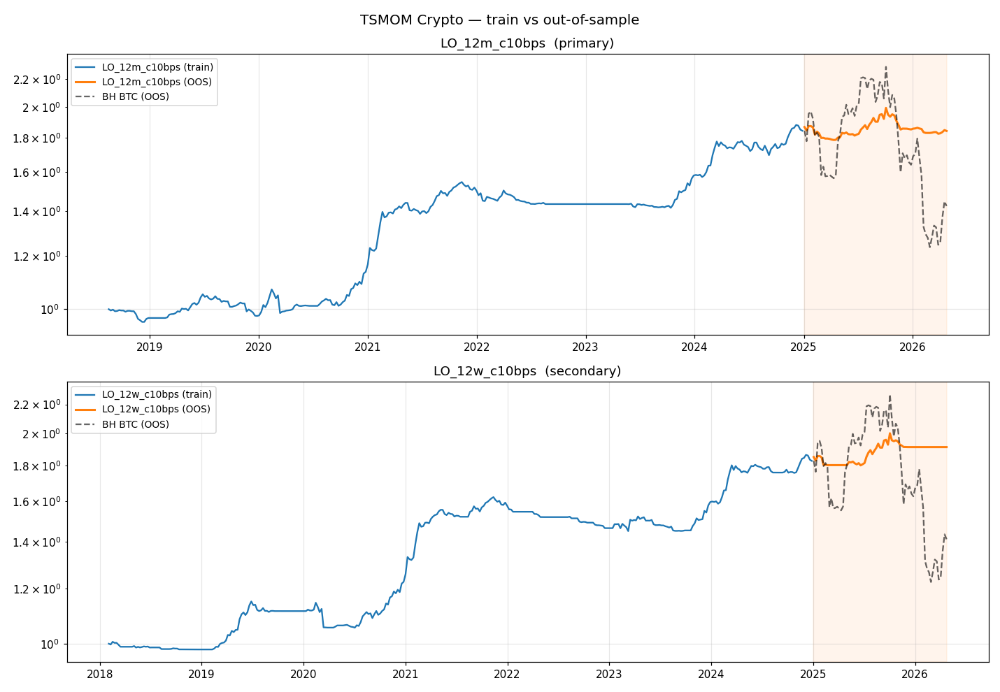

# TSMOM Crypto — Out-of-Sample Validation (Phase 10 step 4)

*Generated: 2026-04-21 17:23 UTC*

## Setup

| Item | Value |
|---|---|
| Training window | 2017-08-17 -> 2024-12-31 |
| Held-out OOS    | 2025-01-01 -> 2026-04-24 |
| Variants        | LO/12m/10bps (primary), LO/12w/10bps (secondary) |
| K-fold          | K=5 on training window, 4-week embargo at boundaries |
| Strategy params | Same as step 3 (no refitting) |

## Gate thresholds (from evaluation_report.md §7.3)

| Gate | Threshold | Direction |
|---|---|---|
| OOS Sharpe | >= 0.4 | absolute |
| OOS Max DD | <= 25% | absolute (>= -25%) |
| OOS vs IS Sharpe drift | within 30% of train Sharpe | (train - OOS) / train <= 0.30 |
| OOS vs BH BTC | Sharpe > BH BTC Sharpe in OOS window | absolute |

All four must pass for GREEN.

## LO_12m_c10bps  (primary)

### Headline

| Slice | Start | End | Weeks | Sharpe | Sortino | CAGR % | Vol % | MaxDD % | Hit monthly % |
|---|---|---|---:|---:|---:|---:|---:|---:|---:|
| Full (IS, step 3) | 2018-08-17 | 2026-04-24 | 402 | 1.06 | 1.574 | 8.27 | 7.74 | -8.46 | 46.74 |
| Train | 2018-08-17 | 2024-12-27 | 333 | 1.263 | 1.87 | 10.09 | 7.81 | -8.46 | 44.74 |
| **OOS** | 2025-01-03 | 2026-04-24 | 69 | 0.03 | 0.044 | -0.05 | 7.31 | -8.46 | 53.33 |
| BH BTC OOS | 2025-01-03 | 2026-04-24 | 68 | -0.334 | -0.477 | -17.97 | 37.55 | -46.11 | 53.33 |
| BH BTC train | 2017-08-18 | 2024-12-27 | 384 | 0.947 | 1.489 | 53.08 | 72.05 | -81.62 | 53.41 |

### Gate check

🔴 **RED — at least one gate failed**

| Gate | Result |
|---|---|
| OOS Sharpe >= 0.4 | FAIL  (0.03) |
| OOS MaxDD >= -25% | PASS  (-8.46%) |
| OOS within 30% of train Sharpe | FAIL  (drift = 0.976) |
| OOS Sharpe > BH BTC OOS Sharpe | PASS  (strat 0.03 vs BH -0.334) |

### Purged K-fold diagnostics (training window only)

| Fold | Start | End | Weeks | Sharpe | CAGR % | MaxDD % |
|---:|---|---|---:|---:|---:|---:|
| 1 | 2018-08-17 | 2019-11-15 | 66 | 0.366 | 1.6 | -4.27 |
| 2 | 2019-11-22 | 2021-02-26 | 67 | 1.921 | 26.25 | -7.8 |
| 3 | 2021-03-05 | 2022-06-03 | 66 | 0.694 | 4.52 | -6.41 |
| 4 | 2022-06-10 | 2023-09-15 | 67 | -0.928 | -1.45 | -1.96 |
| 5 | 2023-09-22 | 2024-12-27 | 67 | 2.367 | 22.86 | -4.78 |

Fold Sharpe stats: mean **0.884**, std **1.172**, min -0.928, max 2.367.

## LO_12w_c10bps  (secondary)

### Headline

| Slice | Start | End | Weeks | Sharpe | Sortino | CAGR % | Vol % | MaxDD % | Hit monthly % |
|---|---|---|---:|---:|---:|---:|---:|---:|---:|
| Full (IS, step 3) | 2018-02-02 | 2026-04-24 | 430 | 1.16 | 1.703 | 8.2 | 6.97 | -10.6 | 41.84 |
| Train | 2018-02-02 | 2024-12-27 | 361 | 1.27 | 1.92 | 9.12 | 7.03 | -10.6 | 42.68 |
| **OOS** | 2025-01-03 | 2026-04-24 | 69 | 0.553 | 0.708 | 3.56 | 6.6 | -4.44 | 33.33 |
| BH BTC OOS | 2025-01-03 | 2026-04-24 | 68 | -0.334 | -0.477 | -17.97 | 37.55 | -46.11 | 53.33 |
| BH BTC train | 2017-08-18 | 2024-12-27 | 384 | 0.947 | 1.489 | 53.08 | 72.05 | -81.62 | 53.41 |

### Gate check

🔴 **RED — at least one gate failed**

| Gate | Result |
|---|---|
| OOS Sharpe >= 0.4 | PASS  (0.553) |
| OOS MaxDD >= -25% | PASS  (-4.44%) |
| OOS within 30% of train Sharpe | FAIL  (drift = 0.565) |
| OOS Sharpe > BH BTC OOS Sharpe | PASS  (strat 0.553 vs BH -0.334) |

### Purged K-fold diagnostics (training window only)

| Fold | Start | End | Weeks | Sharpe | CAGR % | MaxDD % |
|---:|---|---|---:|---:|---:|---:|
| 1 | 2018-02-02 | 2019-06-14 | 72 | 1.714 | 7.89 | -2.5 |
| 2 | 2019-06-21 | 2020-10-30 | 72 | 0.282 | 1.89 | -8.27 |
| 3 | 2020-11-06 | 2022-03-18 | 72 | 2.42 | 25.2 | -4.72 |
| 4 | 2022-03-25 | 2023-08-04 | 72 | -0.753 | -3.75 | -6.17 |
| 5 | 2023-08-11 | 2024-12-27 | 73 | 2.222 | 17.24 | -2.68 |

Fold Sharpe stats: mean **1.177**, std **1.221**, min -0.753, max 2.420.

## Equity plot

## Caveats

- The held-out window is ~16 months. Annualized Sharpe from ~60-70 weekly observations has wide confidence intervals (rough std error of Sharpe ~ sqrt(1/n_weeks * 52) = 0.9 for a single observation — so OOS Sharpe measurements are noisy).
- Strategy parameters (12m lookback, 24w vol, 10% target) come from AQR conventions, not fit on this data. That makes the OOS test cleaner than it would be for a ML-fit model — but the cost knob (10 bps) and rebalance rule *were* chosen after seeing step 3.
- K-fold is used as a stability diagnostic here, not for parameter selection. A large Sharpe spread across folds indicates regime-dependent performance; a tight spread indicates consistency.
- No funding cost on any short (we dropped shorts, so not applicable).
- Today's partial candle dropped during load; OOS ends at the last fully completed weekly Friday.

## Files

- `data/research/tsmom_crypto_oos_metrics.csv` — every slice, every variant, row per fold
- `docs/research/tsmom_crypto_oos_equity.png` — train vs OOS equity curves + BH BTC overlay
- `improvements.db::tsmom_runs` — new rows with scope `crypto_<variant>_train` and `crypto_<variant>_oos`
- `scripts/research_tsmom_crypto_oos.py` — re-runnable (reuses step-3 backtest engine)
