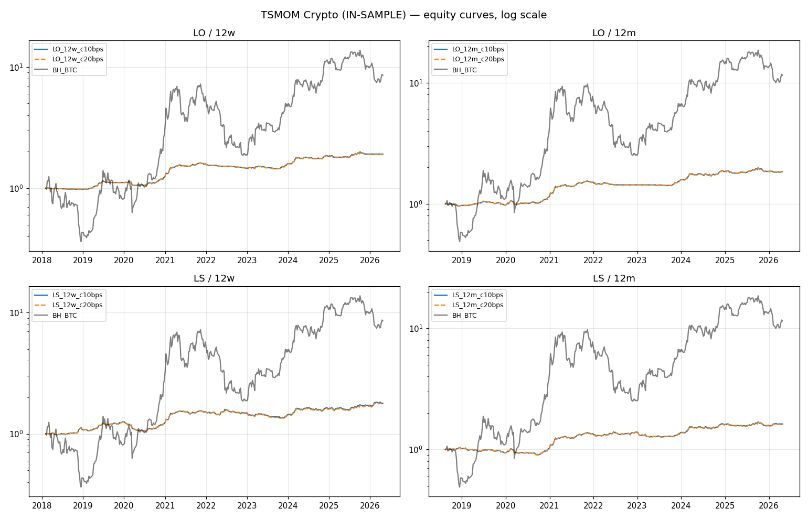

# TSMOM Crypto Prototype — IN-SAMPLE Results

*Generated: 2026-04-21 17:15 UTC*
*Source: Binance D1 data (BTC/ETH/BNB/SOL USDT), resampled to weekly Friday close*

> **⚠ IN-SAMPLE WARNING.** All numbers below use every available data point for parameter selection. 
> Out-of-sample validation is Phase 10 step 4 (Purged K-Fold on 2017-2024, held-out test 2025-2026). 
> Any Sharpe reported here is an **upper bound**; real out-of-sample performance will be lower.

## Setup

| Parameter | Value |
|---|---|
| Universe | BTC/USDT, ETH/USDT, BNB/USDT, SOL/USDT (Binance global) |
| Universe policy | Dynamic — BTC+ETH from 2017-08-17, BNB from 2017-11-06, SOL from 2020-08-11 |
| Frequency | D1 resampled to W-FRI close, weekly rebalance |
| Vol estimator | 24-week rolling stdev × √52 |
| Target portfolio vol | 10% annualized |
| Per-asset weight | `sign(mom) × (target_vol / N_active) / σ_asset`, capped at ±1.0 |
| Weight lag | 1 week (signal at close(t) earns return of t+1) |
| Variants | direction × lookback × cost = 2 × 2 × 2 = 8 |

## All Variants

| Variant | Start | End | Years | CAGR % | Vol % | Sharpe | Sortino | MaxDD % | Calmar | Hit % (mo) | Weekly turnover |
|---|---|---|---:|---:|---:|---:|---:|---:|---:|---:|---:|
| `crypto_LO_12w_c10bps` | 2018-02-02 | 2026-04-24 | 8.22 | 8.2 | 6.97 | **1.16** | 1.703 | -10.6 | 0.773 | 41.84 | 0.0181 |
| `crypto_LO_12w_c20bps` | 2018-02-02 | 2026-04-24 | 8.22 | 8.1 | 6.97 | **1.146** | 1.687 | -10.8 | 0.75 | 41.84 | 0.0181 |
| `crypto_LO_12m_c10bps` | 2018-08-17 | 2026-04-24 | 7.69 | 8.27 | 7.74 | **1.06** | 1.574 | -8.46 | 0.978 | 46.74 | 0.0114 |
| `crypto_LO_12m_c20bps` | 2018-08-17 | 2026-04-24 | 7.69 | 8.21 | 7.74 | **1.052** | 1.566 | -8.55 | 0.96 | 46.74 | 0.0114 |
| `crypto_LS_12w_c10bps` | 2018-02-02 | 2026-04-24 | 8.22 | 7.3 | 8.72 | **0.848** | 1.477 | -16.36 | 0.446 | 50.0 | 0.0355 |
| `crypto_LS_12w_c20bps` | 2018-02-02 | 2026-04-24 | 8.22 | 7.1 | 8.72 | **0.826** | 1.441 | -16.46 | 0.432 | 50.0 | 0.0355 |
| `crypto_LS_12m_c10bps` | 2018-08-17 | 2026-04-24 | 7.69 | 6.52 | 8.39 | **0.79** | 1.217 | -13.14 | 0.496 | 60.87 | 0.0205 |
| `crypto_LS_12m_c20bps` | 2018-08-17 | 2026-04-24 | 7.69 | 6.4 | 8.39 | **0.778** | 1.198 | -13.32 | 0.481 | 59.78 | 0.0205 |

## Buy-and-Hold BTC — benchmark over the same window

| Variant window | BTC CAGR % | BTC Sharpe | BTC MaxDD % |
|---|---:|---:|---:|
| 12w (2018-02-02 → 2026-04-24) | 29.82 | 0.731 | -74.23 |
| 12m (2018-08-17 → 2026-04-24) | 37.44 | 0.826 | -74.23 |

## Equity curves

## Decisions this data supports (reviewer to confirm)

- Does any variant clear the Phase-10 gate (**Sharpe ≥ 0.4 after costs**, in-sample)?
- Does the strategy **beat buy-and-hold BTC** on CAGR over the same window?
- Is the 12-week or 12-month lookback preferred? Does the ranking hold at 20 bps (cost stress)?
- Is long-only alone competitive, or does long-short add meaningful diversification?

## Known in-sample biases

- **Full-period parameter selection.** Every knob (lookback, vol window, vol target, cost) is set on the same data we evaluate. Step 4 (OOS) will puncture overly optimistic numbers.
- **No funding cost on shorts.** Real SOL/BNB short positions pay funding (~5-20% annual drag). LS variants are optimistic.
- **No slippage model.** 10-20 bps cost covers taker fees but not market impact for larger AUM.
- **Survivorship bias.** BTC/ETH/BNB/SOL all survived. Other coins that delisted are not in the universe.
- **Today's candle dropped** during load; backtest ends at the most recent completed weekly bar.

## Files

- `data/research/tsmom_crypto_equity.csv` — weekly equity curves (all variants + BH_BTC)
- `data/research/tsmom_crypto_positions.csv` — per-week positions (primary variant LO/12w/10bps)
- `data/research/tsmom_crypto_metrics.csv` — metrics for all variants and benchmarks
- `docs/research/tsmom_crypto_equity_curves.png` — comparison plot
- `improvements.db::tsmom_runs` — one row per variant, `scope='crypto_*'`
- `scripts/research_tsmom_crypto.py` — re-runnable
